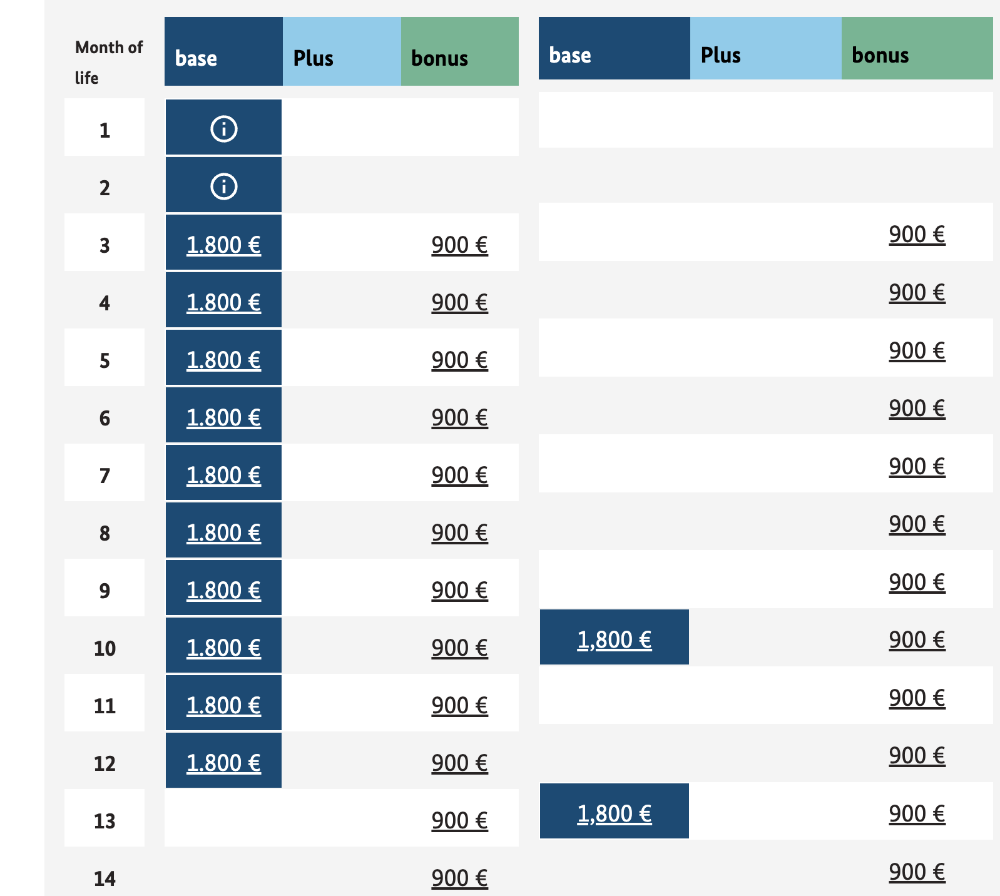

### Prepare for Birth
- bring to hospital
    - documents
        - parents' passport
        - parents' birth certificate
    - for mama
        - tbd
    - for baby
        - tbd
- from hospital home
    - tbd

### Tasks after Birth
- [ ] contact insurance (tk) for adding new born's name
- [ ] apply for Kindergeld
- [ ] apply for Elterngeld
- [ ] mama upload birth certificate to employer
- [ ] mama confirm Elternzeit with employer
- [ ] papa apply Elternzeit with employer (can be done later, just 7 weeks before it starts)
- [ ] contact Kindergarten
- [ ] contact Kinderartzt (for U3 termine)
- [ ] ? apply for passport / id ? Rathaus?
- [ ] earring piecing

### Kindergeld
- [information about Kindergeld](https://www.arbeitsagentur.de/familie-und-kinder/infos-rund-um-kindergeld)
- [application website](https://www.arbeitsagentur.de/familie-und-kinder/infos-rund-um-kindergeld/kindergeld-anspruch-hoehe-dauer)
- note: Note for families with newborn children
A few days after the birth of your child, you will automatically receive a welcome letter from the family allowance office . This letter contains your personal access code for the child benefit application. If you use the access code, most of the information will already be filled in for you .

Our recommendation: Wait for the letter before you submit your child benefit application. If you have already submitted an application, you can ignore the welcome letter.

### Elternzeit / Elterngeld
- [Elterngeld/zeit Intro and Planner](https://www.bmfsfj.de/)
    - 
- [Application Info List](https://familienportal.de/familienportal/rechner-antraege/antragsformulare)
- [Direct Application Entry](https://www.elterngeld-digital.de/ams/Elterngeld)
- [New Regulation since 2024.4](https://www.bmfsfj.de/bmfsfj/themen/familie/familienleistungen/neuregelungen-beim-elterngeld-fuer-geburten-ab-1-april-2024-228588)

### Passport / ID / tax id nr